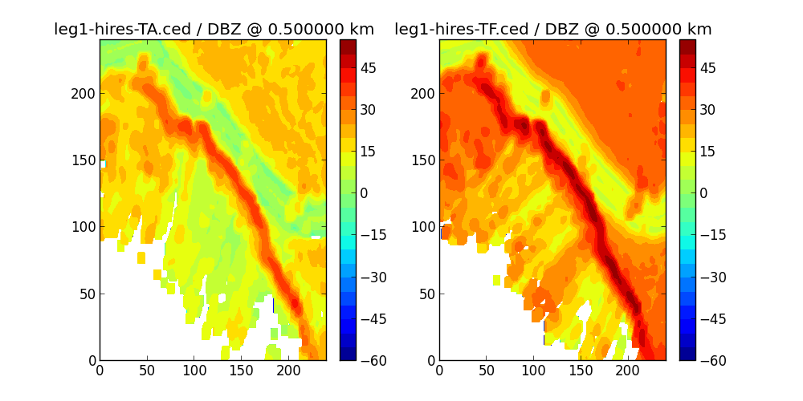
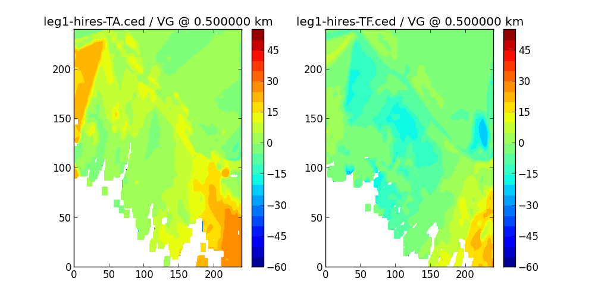
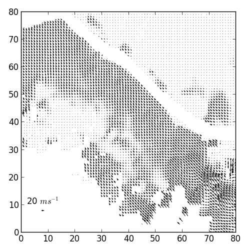

Dual Doppler Example
====================

Xiaowen Tang originally put together this example of dual-doppler wind
synthesis using the ELDORA fore and aft radars.  It has been ported to the
API of the `cedric` package, and several of the routines in the package
came from that original example.

After building the source tree, you can run this example like below, from
the `python` directory under the cedric source tree::

  cd cedric/python
  python test_ddop.py

The script first reads in two volumes from the respective data files in
`cedric/testdata/ddop`::

    import cedric
    ...
    file1 = "../testdata/ddop/leg1-hires-TA.ced"
    file2 = "../testdata/ddop/leg1-hires-TF.ced"
    volume1 = cedric.read_volume(file1)
    data1 = volume1.data
    volume2 = cedric.read_volume(file2)
    data2 = volume2.data

Then it displays comparison plots for the reflectivity and velocity fields.
After each plot appears, close the plot window and the script continues::

    dbz = volume1['DBZ']
    cp.compare_fields(dbz[:,:,1], volume2['DBZ'][:,:,1])
    cp.compare_fields(volume1['VG'][:,:,1], volume2['VG'][:,:,1])

Note how Variable instances can be sliced when passed to the plot method.
The generated plots use the slicing to annotate the plots with the volume
file, variable name, and height.

   Gridded DBZ fields from the fore and aft antennas.

   Side-by-side plot of the velocity fields.

The `caluvw3d` python method runs the actual wind computation, using the
modified CALUVW3d FORTRAN routine which operates on the whole 3D grid in
one call.  Any intermediate array parameters are created in this call
before the internal FORTRAN method is called, and the wrapper assumes some
conventions like -1000.0 for bad values::

    (u, v, eu, ev) = cedric.caluvw3d(volume1, volume2)
    eu[np.abs(eu*64)>=32768.] = -1000.
    ev[np.abs(ev*64)>=32768.] = -1000.
    u[eu==-1000.] = -1000.
    v[ev==-1000.] = -1000.

The next section computes a single array containing the maximum DBZ value
at each grid point between the two volumes.  The `idx` array is a `numpy`
boolean array which can be used to index the `mz` array and assign to only
those grid points where `data2` contains the larger DBZ value.  Finally the
fall speed correction is applied using the `vt_correction` method from
`cedric.algorithms`.

    from cedric.algorithms import vt_correction
    ...
    mz = dbz.data().copy()
    idx = dbz.data() < data2['DBZ']
    mz[idx] = data2['DBZ'][idx]
    grid1 = volume1.grid
    zz = np.arange(grid1.z[2],dtype=np.float32)*grid1.z[1]+grid1.z[0]
    rho= np.exp(-0.1*zz)
    print 'rho',rho
    #fallspeed correction
    vt_correction(u, v, eu, ev, mz, rho, 1.5, 0.105, 0.4, -1000.)

See the `test_ddop.py` source code for the rest of the processing.  Some of
the FORTRAN library routines are called directly through the `f2py`
interface, by importing the FORTRAN library like so::

    from cedric import libcedric

The FORTRAN calls are meant to be wrapped with more convenient calling
interfaces, and where appropriate they should be integrated with the Volume
and Variable types.  However that has not been done yet for all of the
routines accessible in the FORTRAN library.

Finally the computed wind field is plotted with a `matplotlib` *quiver*
plot::

    plt.figure(figsize=(8,8))
    Q = plt.quiver(u[::3,::3,1], v[::3,::3,1],scale=2000)
    plt.quiverkey(Q, .1, .1, 30., '20 $ms^{-1}$')
    plt.tight_layout()
    plt.show()

   Quiver plot of the synthesized horizontal wind field.

The interface is still very rough.  Besides the need to wrap more of the
CEDRIC FORTRAN library and incorporate more of its computations in the
python interface, the python layer is still very primitive as far as
handling the radar data and plotting it.  For example, so far the python
layer is very specific to the ELDORA example described above, so it needs
to be extended to other types of data and other kinds of radar analyses.

